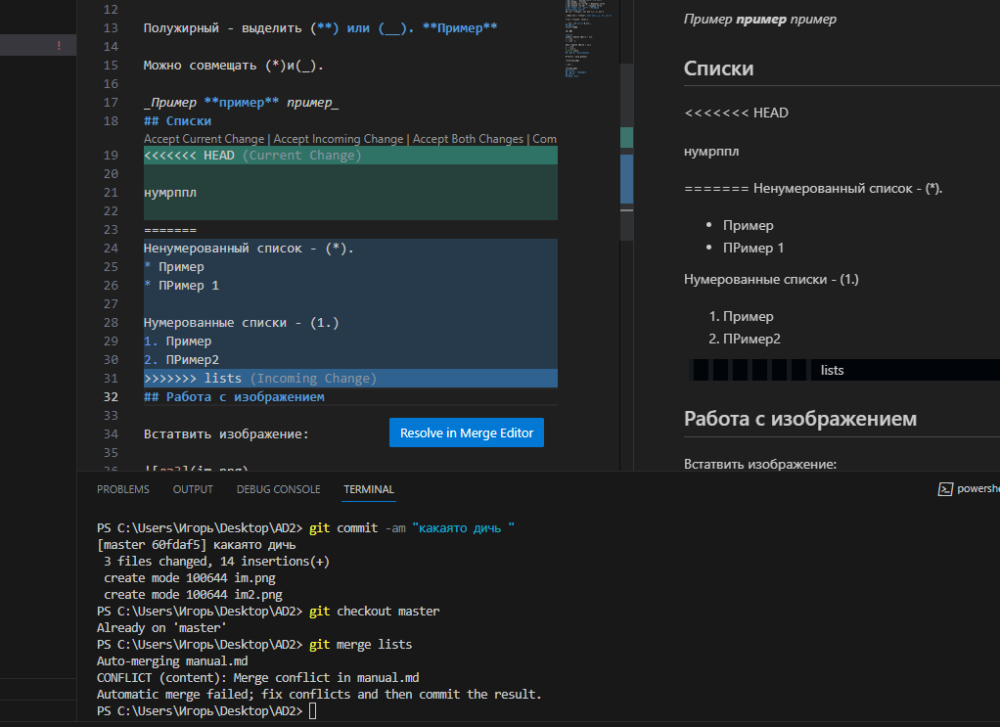
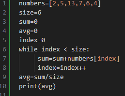
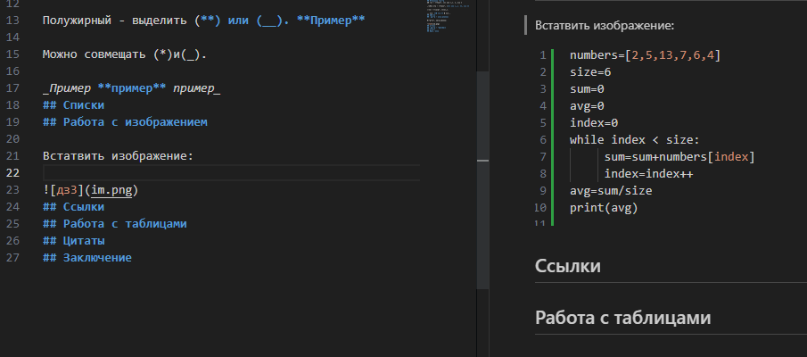

# Git. Руководство пользователя
## Основные команды
* git inint - инициализирует локальный репозиторий
* git commit - создает коммит
* git diff - разница между содержимым
* git merge - слияние

* git branch -d "ветка" - удаление ветки
* git branch "ветка" - создание ветки
# Инструкция для работы с Markdown
## Выделение текста
Курсив - выделить (*) или (_). *Пример*

Полужирный - выделить (**) или (__). **Пример**

Можно совмещать (*)и(_).

_Пример **пример** пример_
## Списки

Ненумерованный список - (*).
* Пример
* ПРимер 1

Нумерованные списки - (1.)
1. Пример
2. ПРимер2
## Работа с изображением

Встатвить изображение:

Пример:

## Ссылки
## Работа с таблицами
## Цитаты
## Заключение